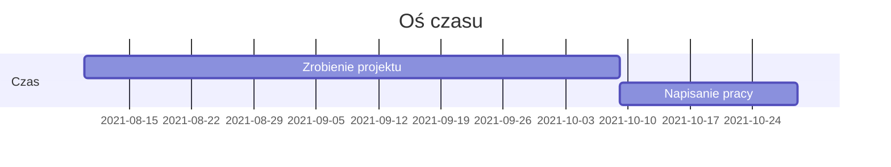

Oprogramowanie do monitorowania i analizy ruchu pojazdów w obszarze zamkniętym
===


## Plan pracy

[TOC]

## Schemat działania


## Strunktura projektu i technologie

Struktura projektu będzie podzielona na części. Każda część składa się z następujących technologii.


1. Raspberry PI
    1.Python
    2.
3. Backend
    1.FastAPI - 
    2.SQLAlchemy - ORM
    3.
5. Database
    1.PostgresSQL
    2.
7. Frontend
    1.HTML
    2.CSS
    3.JS
    4.

Oś czasu projektu
---


<!-- > Read more about mermaid here: http://mermaid-js.github.io/mermaid/ -->

## FAQ

:::info
**Find this document incomplete?** Leave a comment!
:::

###### tags: `Praca dyplomowa` `Dokumentacja` `Python` `Raspberry`  

<!-- 
User story
---

```gherkin=
Feature: Guess the word

  # The first example has two steps
  Scenario: Maker starts a game
    When the Maker starts a game
    Then the Maker waits for a Breaker to join

  # The second example has three steps
  Scenario: Breaker joins a game
    Given the Maker has started a game with the word "silky"
    When the Breaker joins the Maker's game
    Then the Breaker must guess a word with 5 characters
```
> I choose a lazy person to do a hard job. Because a lazy person will find an easy way to do it. [name=Bill Gates]


```gherkin=
Feature: Shopping Cart
  As a Shopper
  I want to put items in my shopping cart
  Because I want to manage items before I check out

  Scenario: User adds item to cart
    Given I'm a logged-in User
    When I go to the Item page
    And I click "Add item to cart"
    Then the quantity of items in my cart should go up
    And my subtotal should increment
    And the warehouse inventory should decrement
```

> Read more about Gherkin here: https://docs.cucumber.io/gherkin/reference/

Perspektywa użytkownika
---
```sequence < mozna do tego wykorzystać
